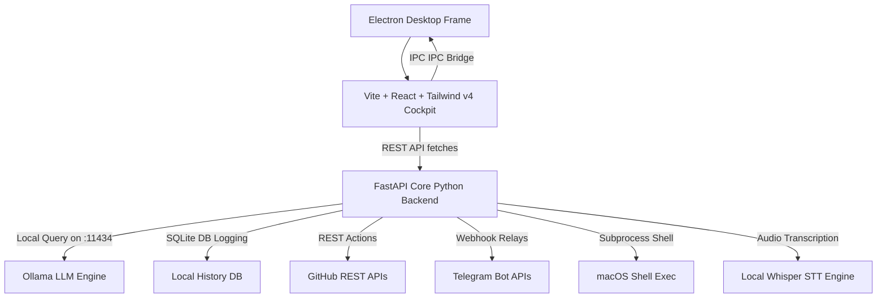

# 🛡️ Nexus AI — Desktop Command-Center OS

Nexus AI is a futuristic, offline-first command-center desktop application designed for macOS (optimized for Apple Silicon M-series/M5). It unifies local AI model capabilities, real-time telemetry analytics, terminal execution layers, and third-party integrations (GitHub repositories control, Telegram alerts bot system, and Market sentiment trackers) in a single dark glassmorphic cockpit.

---

## 🏗️ Architecture Overview



---

## 📁 Workspace Layout

```
NexusAI/
├── backend/                # FastAPI central routing controller
│   ├── main.py             # Server endpoints & safety middleware
│   ├── router.py           # Intent classifiers & provider routers
│   └── models/             # LLM client wrappers (Ollama, OpenAI, xAI)
├── frontend/               # React Vite dashboard cockpit styled with Tailwind v4
├── electron/               # Desktop packaging process (main.js, preload.js)
├── database/               # Offline SQLite schema and connection helpers
├── github_agent/           # Git status REST integrations
├── telegram_bot/           # Notification relays and webhook command handlers
├── market_brain/           # Index sentiment analyzers & watchlists
├── voice/                  # Local Whisper speech recognition wrappers
├── config/                 # YAML settings parameters
├── .env                    # Secrets key file (gitignored)
└── package.json            # Workspace launch coordinator scripts
```

---

## ⚙️ Installation Guide

### Prerequisites

Ensure you have the following installed on your MacBook Air:
1. **Node.js** (v18 or higher)
2. **Python** (v3.10 or higher, with conda/venv active)
3. **Ollama** (Running locally with `qwen2.5-coder` weight models)

### Step 1: Clone and Set Up Workspace
Place files in your project directory and navigate to the project root:
```bash
cd NexusAI
```

### Step 2: Install Base Script Dependencies
Install Electron, concurrently, and development packages in the root, and Vite packages in the frontend:
```bash
npm run install:all
```

### Step 3: Set Up Python Backend Environment
Activate your conda environment (e.g. `nexus-env`) and install FastAPI dependencies:
```bash
conda activate nexus-env
pip3 install fastapi uvicorn pyyaml python-dotenv httpx
```

### Step 4: Configure Credentials
Duplicate the `.env` template and input your API credentials:
```bash
cp .env.example .env
# Edit .env variables to add GITHUB_PAT, TELEGRAM_BOT_TOKEN etc.
```

---

## 🚀 Execution Instructions

### Run the Complete Stack Concurrently (Dev Mode)
To launch the FastAPI backend, start the React dev server, and boot the Electron browser window in a single terminal process, run:
```bash
npm start
```

### Manual Individual Commands

- **Run Backend API Server only (Port 8000):**
  ```bash
  python3 -m uvicorn backend.main:app --host 127.0.0.1 --port 8000
  ```
- **Run Vite React Dev Server only (Port 5173):**
  ```bash
  cd frontend && npm run dev
  ```
- **Launch Electron Main Frame only:**
  ```bash
  npm run electron:run
  ```

---

## 🛣️ Step-by-Step Development Roadmap

```
┌─────────────────────────────────────────────────────────────┐
│                   NEXUS AI ROADMAP PROGRESS                 │
├───────────────┬─────────────────────────────────────────────┤
│ PHASE 1 [X]   │ Base Folder Scaffolding & YAML config files │
├───────────────┼─────────────────────────────────────────────┤
│ PHASE 2 [X]   │ SQLite schema and connection logs build     │
├───────────────┼─────────────────────────────────────────────┤
│ PHASE 3 [X]   │ FastAPI REST endpoints & routers routing    │
├───────────────┼─────────────────────────────────────────────┤
│ PHASE 4 [X]   │ React frontend & Tailwind v4 view cockpit   │
├───────────────┼─────────────────────────────────────────────┤
│ PHASE 5 [X]   │ Electron IPC bindings and concurrently run  │
├───────────────┼─────────────────────────────────────────────┤
│ PHASE 6 [ ]   │ CoreML/Neural Engine speech model builds    │
├───────────────┼─────────────────────────────────────────────┤
│ PHASE 7 [ ]   │ Production packaging (.dmg builds)          │
└───────────────┴─────────────────────────────────────────────┘
```

---

## 🔒 Security Principles
- **No Silent Cloud Escalation:** Calls to paid APIs (OpenAI/xAI) must be explicitly enabled in `config/config.yaml` or through settings. The system defaults to local Ollama.
- **Terminal Sanitization:** Rejects destructive CLI prefixes (like `rm -rf`, `sudo`, `dd`) on the REST router and logs blocked attempts to the SQLite database.
